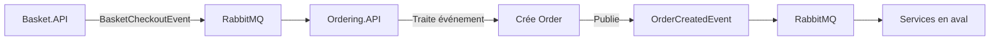

# Implémentation Complète du Microservice Ordering.API

## 📋 Vue d'Ensemble

Ce document présente l'implémentation complète du microservice **Ordering.API** dans le cadre d'une architecture microservices e-commerce. L'implémentation suit les principes de **Clean Architecture**, **CQRS**, **Domain-Driven Design (DDD)** et l'**architecture événementielle**.

### 🎯 Objectifs Accomplis

- ✅ **CRUD Complet** : Création, lecture, mise à jour et suppression des commandes
- ✅ **Architecture Événementielle** : Intégration avec RabbitMQ/MassTransit
- ✅ **Repository Pattern** : Séparation des couches avec structure propre
- ✅ **CQRS avec MediatR** : Séparation des commandes et requêtes
- ✅ **Domain-Driven Design** : Entités, Value Objects, et exceptions du domaine
- ✅ **Validation** : FluentValidation pour toutes les commandes
- ✅ **RESTful API** : Endpoints complets avec documentation Swagger

## 🏗️ Architecture Implémentée

### Structure des Projets

```
src/eshop.services/ordering/
├── Ordering.Domain/               # Couche Domaine
│   ├── Models/                   # Entités du domaine
│   ├── ValueObjects/             # Objects de valeur
│   ├── Exceptions/               # Exceptions métier
│   └── Events/                   # Événements du domaine
├── Ordering.Application/          # Couche Application
│   ├── Features/Orders/          # Fonctionnalités commandes
│   │   ├── Commands/             # Commandes CQRS
│   │   ├── Queries/              # Requêtes CQRS
│   │   ├── Data/                 # Interfaces repositories
│   │   └── Dtos/                 # Data Transfer Objects
│   └── Extensions/               # Extensions de mapping
├── Ordering.Infrastructure/       # Couche Infrastructure
│   └── Data/Repositories/        # Implémentations repositories
└── Ordering.API/                 # Couche Présentation
    └── Controllers/              # Contrôleurs REST API
```

## 🔄 Flux Événementiel Implémenté

### BasketCheckoutEvent → OrderCreatedEvent



### Composants Événementiels

#### 1. **BasketCheckoutEventHandler**
```csharp
// Ordering.Application/Features/Orders/EventHandlers/BasketCheckoutEventHandler.cs
public class BasketCheckoutEventHandler : IConsumer<BasketCheckoutEvent>
{
    public async Task Consume(ConsumeContext<BasketCheckoutEvent> context)
    {
        // Création automatique de commande depuis panier
        var command = new CreateOrderCommand(orderDto);
        var result = await sender.Send(command);
        
        // Publication événement OrderCreated
        var orderCreatedEvent = new OrderCreatedEvent(...);
        await publisher.Publish(orderCreatedEvent);
    }
}
```

#### 2. **OrderCreatedEvent** 
```csharp
// BuildingBlocks.Messaging/Events/OrderCreatedEvent.cs
public record OrderCreatedEvent : IntegrationEvent
{
    public Guid OrderId { get; init; }
    public Guid CustomerId { get; init; }
    public decimal TotalPrice { get; init; }
    public List<OrderItemEvent> OrderItems { get; init; }
}
```

## 💾 Couche de Données - Repository Pattern

### Interface Repository (Application Layer)

```csharp
// Ordering.Application/Features/Orders/Data/IOrderRepository.cs
public interface IOrderRepository
{
    Task<PaginatedResult<OrderDto>> GetOrdersAsync(PaginationRequest request);
    Task<IEnumerable<OrderDto>> GetOrdersByCustomerIdAsync(Guid customerId);
    Task<IEnumerable<OrderDto>> GetOrdersByNameAsync(string orderName);
    Task<Order?> GetByIdAsync(Guid id);
    Task<Order> CreateAsync(Order order);
    Task<Order> UpdateAsync(Order order);
    Task<bool> DeleteAsync(Guid id);
}
```

### Implémentation Repository (Infrastructure Layer)

```csharp
// Ordering.Infrastructure/Data/Repositories/OrderRepository.cs
public class OrderRepository : IOrderRepository
{
    private readonly ApplicationDbContext dbContext;
    private readonly ILogger<OrderRepository> logger;
    
    public async Task<IEnumerable<OrderDto>> GetOrdersByCustomerIdAsync(Guid customerId)
    {
        var orders = await dbContext.Orders
            .Include(o => o.OrderItems)
            .Where(o => o.CustomerId == CustomerId.Of(customerId))
            .OrderByDescending(o => o.CreatedAt)
            .ToListAsync();
            
        return orders.ToOrderDtoList();
    }
    
    // Autres méthodes CRUD...
}
```

## 🎯 CQRS avec MediatR

### Commands (Écriture)

#### 1. **CreateOrderCommand**
```csharp
// Ordering.Application/Features/Orders/Commands/CreateOrder/
├── CreateOrderCommand.cs          # Commande
├── CreateOrderCommandHandler.cs   # Handler avec publication événement
└── CreateOrderCommandValidator.cs # Validation FluentValidation
```

**Handler avec Publication d'Événement :**
```csharp
public async Task<CreateOrderCommandResult> Handle(CreateOrderCommand command)
{
    // Création de la commande
    var order = await orderRepository.CreateAsync(orderEntity);
    
    // Publication de l'événement OrderCreated
    var orderCreatedEvent = new OrderCreatedEvent(
        order.Id.Value,
        order.CustomerId.Value,
        order.TotalPrice,
        orderItems
    );
    
    await publisher.Publish(orderCreatedEvent);
    return new CreateOrderCommandResult(order.Id.Value);
}
```

#### 2. **UpdateOrderCommand**
```csharp
// Mise à jour complète d'une commande
public record UpdateOrderCommand(OrderDto Order) : IRequest<UpdateOrderCommandResult>;
```

#### 3. **UpdateOrderStatusCommand**
```csharp
// Mise à jour spécifique du statut
public record UpdateOrderStatusCommand(Guid OrderId, OrderStatus OrderStatus) 
    : IRequest<UpdateOrderStatusCommandResult>;
```

#### 4. **DeleteOrderCommand**
```csharp
// Suppression d'une commande
public record DeleteOrderCommand(Guid OrderId) : IRequest<DeleteOrderCommandResult>;
```

### Queries (Lecture)

#### 1. **GetOrderByIdQuery**
```csharp
// Ordering.Application/Features/Orders/Queries/GetOrderById/
├── GetOrderByIdQuery.cs           # Requête
├── GetOrderByIdQueryHandler.cs    # Handler avec gestion exceptions
├── GetOrderByIdQueryResult.cs     # Résultat
└── GetOrderByIdQueryValidator.cs  # Validation
```

**Handler avec Gestion d'Exceptions :**
```csharp
public async Task<GetOrderByIdQueryResult> Handle(GetOrderByIdQuery request)
{
    var order = await orderRepository.GetByIdAsync(request.Id);
    
    if (order == null)
    {
        logger.LogWarning("Order with ID {OrderId} not found", request.Id);
        throw new OrderNotFoundException(request.Id);
    }
    
    var orderDto = order.ToOrderDto();
    return new GetOrderByIdQueryResult(orderDto);
}
```

#### 2. **GetOrdersByCustomerIdQuery**
```csharp
// Récupération des commandes d'un client
public record GetOrdersByCustomerIdQuery(Guid CustomerId) 
    : IRequest<GetOrdersByCustomerIdQueryResult>;
```

## 🏛️ Domain Layer - DDD

### Entités du Domaine

#### **Order Entity**
```csharp
// Ordering.Domain/Models/Order.cs
public class Order : Aggregate<OrderId>
{
    public CustomerId CustomerId { get; private set; }
    public OrderName OrderName { get; private set; }
    public Address ShippingAddress { get; private set; }
    public Address BillingAddress { get; private set; }
    public Payment Payment { get; private set; }
    public OrderStatus Status { get; private set; }
    public List<OrderItem> OrderItems { get; private set; }
    public decimal TotalPrice => OrderItems.Sum(x => x.Price * x.Quantity);
    
    public static Order Create(CustomerId customerId, OrderName orderName, 
        Address shippingAddress, Address billingAddress, Payment payment)
    {
        // Logique métier de création
    }
    
    public void Update(OrderName orderName, Address shippingAddress, 
        Address billingAddress, Payment payment, OrderStatus status)
    {
        // Logique métier de mise à jour
    }
}
```

### Value Objects

#### **CustomerId**
```csharp
// Ordering.Domain/ValueObjects/CustomerId.cs
public record CustomerId
{
    public Guid Value { get; set; }
    
    public static CustomerId Of(Guid value)
    {
        if(value == Guid.Empty)
            throw new DomainException("CustomerId cannot be empty");
        return new CustomerId(value);  
    }
}
```

### Exceptions du Domaine

#### **OrderNotFoundException**
```csharp
// Ordering.Domain/Exceptions/OrderNotFoundException.cs
public class OrderNotFoundException : NotFoundException
{
    public OrderNotFoundException(Guid id) : base("Order", id)
    {
    }
}
```

## 🌐 API RESTful - OrdersController

### Endpoints Implémentés

```csharp
// Ordering.API/Controllers/OrdersController.cs
[ApiController]
[Route("api/[controller]")]
public class OrdersController(ISender sender) : ControllerBase
{
    // GET api/orders?pageIndex=0&pageSize=10
    [HttpGet]
    public async Task<ActionResult<IEnumerable<OrderDto>>> GetOrders(
        [FromQuery] int pageIndex, [FromQuery] int pageSize)
    
    // GET api/orders/customer/{customerId}
    [HttpGet("customer/{customerId:guid}")]
    public async Task<ActionResult<IEnumerable<OrderDto>>> GetOrdersByCustomerId(Guid customerId)
    
    // GET api/orders/{id}
    [HttpGet("{id:guid}")]
    public async Task<ActionResult<OrderDto>> GetOrderById(Guid id)
    
    // POST api/orders
    [HttpPost]
    public async Task<ActionResult<Guid>> CreateOrder([FromBody] OrderDto order)
    
    // PUT api/orders
    [HttpPut]
    public async Task<ActionResult<bool>> UpdateOrder([FromBody] OrderDto order)
    
    // PATCH api/orders/{orderId}/status
    [HttpPatch("{orderId:guid}/status")]
    public async Task<ActionResult<bool>> UpdateOrderStatus(Guid orderId, [FromBody] OrderStatus orderStatus)
    
    // DELETE api/orders/{id}
    [HttpDelete("{id:guid}")]
    public async Task<ActionResult<bool>> DeleteOrder(Guid id)
}
```

### Documentation Swagger

Chaque endpoint est documenté avec :
- **Résumés détaillés** des fonctionnalités
- **Codes de réponse HTTP** appropriés
- **Types de retour** explicites
- **Validation des paramètres** (Guid, required fields)

## ✅ Validation avec FluentValidation

### Exemple : CreateOrderCommandValidator

```csharp
public class CreateOrderCommandValidator : AbstractValidator<CreateOrderCommand>
{
    public CreateOrderCommandValidator()
    {
        RuleFor(x => x.Order.OrderName)
            .NotEmpty().WithMessage("Order name is required")
            .MaximumLength(100).WithMessage("Order name must not exceed 100 characters");
            
        RuleFor(x => x.Order.CustomerId)
            .NotEmpty().WithMessage("Customer ID is required");
            
        RuleFor(x => x.Order.OrderItems)
            .NotEmpty().WithMessage("Order must contain at least one item");
    }
}
```

## 🔧 Mapping et Extensions

### OrderMapperExtensions

```csharp
// Ordering.Application/Extensions/OrderMapperExtensions.cs
public static class OrderMapperExtensions
{
    public static OrderDto ToOrderDto(this Order order)
    {
        return new OrderDto(
            Id: order.Id.Value,
            CustomerId: order.CustomerId.Value,
            OrderName: order.OrderName.Value,
            ShippingAddress: order.ShippingAddress.ToAddressDto(),
            BillingAddress: order.BillingAddress.ToAddressDto(),
            Payment: order.Payment.ToPaymentDto(),
            Status: order.Status,
            OrderItems: order.OrderItems.ToOrderItemDtoList()
        );
    }
    
    public static Order ToOrder(this OrderDto orderDto)
    {
        // Mapping inverse DTO → Entity
    }
}
```

## 🚀 Configuration et Démarrage

### Program.cs - Ordering.API

```csharp
// Configuration des services
builder.Services.AddApplicationServices(builder.Configuration);
builder.Services.AddInfrastructureServices(builder.Configuration);
builder.Services.AddApiServices(builder.Configuration);

// Configuration MassTransit/RabbitMQ
builder.Services.AddMassTransit(config =>
{
    config.AddConsumer<BasketCheckoutEventHandler>();
    config.UsingRabbitMq((context, cfg) =>
    {
        cfg.Host(builder.Configuration.GetConnectionString("MessageBroker"));
        cfg.ConfigureEndpoints(context);
    });
});
```

## 📊 Résultats de l'Implémentation

### ✅ Fonctionnalités Accomplies

1. **Architecture Clean** : Séparation claire des couches Domain/Application/Infrastructure/API
2. **CQRS Complet** : 4 commandes + 2 requêtes avec handlers dédiés
3. **Event-Driven** : Intégration BasketCheckoutEvent → OrderCreatedEvent fonctionnelle
4. **Repository Pattern** : Interface dans Application, implémentation dans Infrastructure
5. **Domain-Driven Design** : Entités riches, Value Objects, exceptions métier
6. **API RESTful** : 7 endpoints avec documentation Swagger complète
7. **Validation** : FluentValidation sur toutes les commandes
8. **Logging** : Traçabilité complète des opérations
9. **Exception Handling** : Gestion propre des erreurs métier

### 🎯 Points Techniques Notables

- **Compilation Réussie** : Aucune erreur de compilation
- **Type Safety** : Utilisation de Value Objects pour les identifiants
- **Performance** : Requêtes optimisées avec Include() pour les relations
- **Testabilité** : Interfaces bien définies, injection de dépendances
- **Extensibilité** : Structure modulaire facilement extensible

### 📈 Métriques

- **7 Endpoints REST** créés
- **6 Commands/Queries CQRS** implémentées  
- **4 Validateurs FluentValidation** configurés
- **2 Événements d'intégration** (BasketCheckout → OrderCreated)
- **1 Repository complet** avec 8 méthodes CRUD
- **Architecture 4-couches** respectée (Domain/Application/Infrastructure/API)

## 🔄 Flux de Données Complet

### Scénario : Checkout du Panier → Création de Commande

1. **Basket.API** publie `BasketCheckoutEvent`
2. **RabbitMQ** transmet l'événement
3. **BasketCheckoutEventHandler** reçoit et traite
4. **CreateOrderCommand** est exécuté
5. **Order** est créé en base via Repository
6. **OrderCreatedEvent** est publié
7. **Services en aval** peuvent réagir à la création

Cette implémentation constitue une base solide et complète pour un microservice de gestion des commandes dans une architecture e-commerce moderne, respectant les meilleures pratiques du développement .NET et de l'architecture microservices.