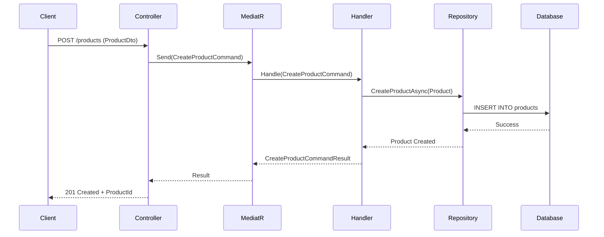
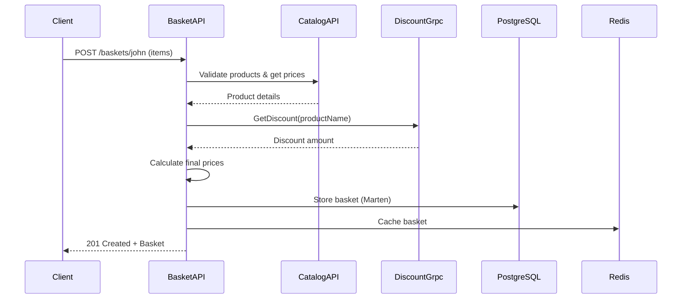
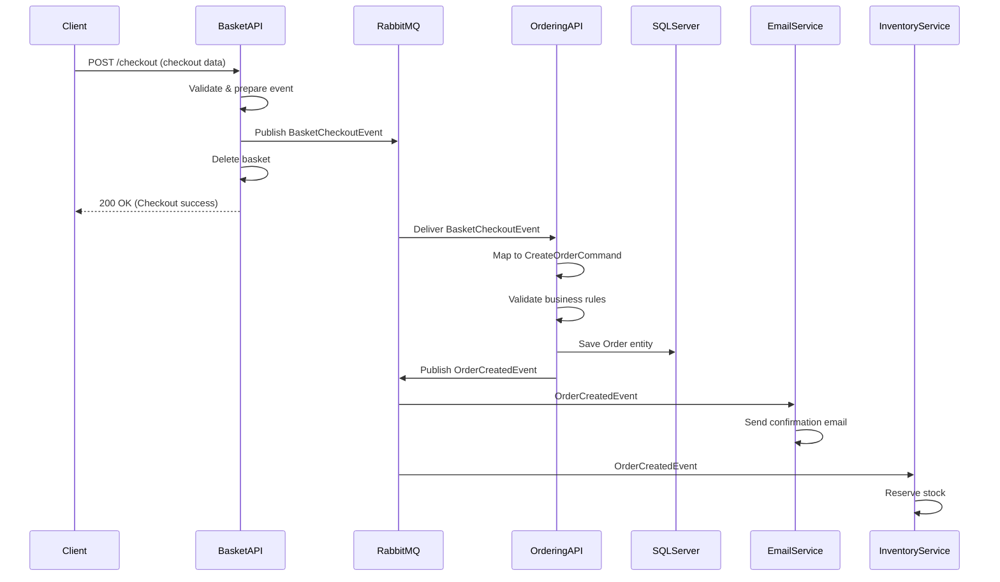

# 🛍️ Guide Complet des Processus Microservices E-Shop

## Table des Matières
1. [Ajout d'un Produit au Catalogue](#1-ajout-dun-produit-au-catalogue)
2. [Création d'un Panier avec Application de Discount](#2-création-dun-panier-avec-application-de-discount)
3. [Création d'une Commande via le Système d'Événements](#3-création-dune-commande-via-le-système-dévénements)

---

# 1. 📦 Ajout d'un Produit au Catalogue

## 🏗️ Architecture du Service Catalog

Le service **Catalog.API** est responsable de la gestion des produits dans le système e-commerce. Il utilise une architecture **CQRS (Command Query Responsibility Segregation)** avec **MediatR**.

### 🔧 Structure du Service

```
Catalog.API/
├── Controllers/ProductsController.cs    # Point d'entrée HTTP
├── Features/
│   └── Products/
│       ├── Commands/CreateProduct/      # Création de produits
│       ├── Queries/GetProducts/         # Récupération de produits
│       └── Dtos/ProductDto.cs          # Objets de transfert
├── Data/
│   └── Repositories/                   # Accès aux données
└── Models/Product.cs                   # Entités métier
```

## 🚀 Processus d'Ajout d'un Produit

### **1️⃣ Requête HTTP - Point d'Entrée**

**Endpoint** : `POST /products`

```csharp
// ProductsController.cs
[HttpPost]
public async Task<ActionResult<CreateProductCommandResult>> CreateProduct([FromBody] CreateProductCommand request)
{
    var result = await sender.Send(request);
    return CreatedAtAction(nameof(GetProductById), new { id = result.ProductId }, result);
}
```

**Payload JSON** :
```json
{
  "name": "iPhone 15 Pro",
  "description": "Smartphone Apple dernière génération",
  "price": 1299.99,
  "category": "Electronics",
  "imageUrl": "https://example.com/iphone15.jpg"
}
```

### **2️⃣ Command Pattern - CreateProductCommand**

```csharp
// CreateProductCommand.cs
public record CreateProductCommand(
    string Name,
    string Description, 
    decimal Price,
    string Category,
    string ImageUrl
) : ICommand<CreateProductCommandResult>;
```

### **3️⃣ Validation Automatique**

```csharp
// CreateProductCommandValidator.cs
public class CreateProductCommandValidator : AbstractValidator<CreateProductCommand>
{
    public CreateProductCommandValidator()
    {
        RuleFor(x => x.Name)
            .NotEmpty().WithMessage("Le nom du produit est obligatoire")
            .MaximumLength(100);
            
        RuleFor(x => x.Price)
            .GreaterThan(0).WithMessage("Le prix doit être supérieur à 0");
            
        RuleFor(x => x.Category)
            .NotEmpty().WithMessage("La catégorie est obligatoire");
    }
}
```

### **4️⃣ Traitement Métier - CreateProductCommandHandler**

```csharp
// CreateProductCommandHandler.cs
public class CreateProductCommandHandler : ICommandHandler<CreateProductCommand, CreateProductCommandResult>
{
    public async Task<CreateProductCommandResult> Handle(CreateProductCommand request, CancellationToken cancellationToken)
    {
        // 1. Création de l'entité Product
        var product = new Product
        {
            Id = Guid.NewGuid(),
            Name = request.Name,
            Description = request.Description,
            Price = request.Price,
            Category = request.Category,
            ImageUrl = request.ImageUrl,
            CreatedAt = DateTime.UtcNow
        };
        
        // 2. Sauvegarde en base de données (PostgreSQL)
        await productRepository.CreateProductAsync(product, cancellationToken);
        
        // 3. Log de succès
        logger.LogInformation("Product {ProductId} created successfully", product.Id);
        
        // 4. Retour du résultat
        return new CreateProductCommandResult(product.Id);
    }
}
```

### **5️⃣ Persistance des Données**

**Base de données** : **PostgreSQL**  
**ORM** : **Entity Framework Core** ou **Marten** (Document DB)

```csharp
// ProductRepository.cs
public async Task CreateProductAsync(Product product, CancellationToken cancellationToken)
{
    await dbContext.Products.AddAsync(product, cancellationToken);
    await dbContext.SaveChangesAsync(cancellationToken);
}
```

## 🎯 Flux Complet - Ajout de Produit



### ✅ Résultat Final

- **Produit créé** en base PostgreSQL
- **ID unique** généré et retourné
- **Validation** automatique des données
- **Logs** pour traçabilité
- **Architecture découplée** via CQRS/MediatR

---

# 2. 🛒 Création d'un Panier avec Application de Discount

## 🏗️ Architecture Multi-Services

La création d'un panier implique **3 microservices** :
- **Basket.API** : Gestion des paniers
- **Catalog.API** : Informations produits  
- **Discount.Grpc** : Calcul des remises

## 🔄 Processus de Création de Panier

### **1️⃣ Initialisation du Panier**

**Endpoint** : `POST /baskets/{userName}`

```csharp
// BasketsController.cs
[HttpPost]
public async Task<ActionResult<CreateBasketCommandResult>> CreateBasket(
    string userName, 
    [FromBody] CreateBasketCommand request)
{
    var result = await sender.Send(request);
    return CreatedAtAction(nameof(GetBasketByUserName), new { userName }, result);
}
```

**Payload** :
```json
{
  "userName": "john.doe",
  "items": [
    {
      "productId": "123e4567-e89b-12d3-a456-426614174000",
      "productName": "iPhone 15 Pro",
      "quantity": 1,
      "price": 1299.99
    }
  ]
}
```

### **2️⃣ Enrichissement des Données Produit**

```csharp
// CreateBasketCommandHandler.cs
public async Task<CreateBasketCommandResult> Handle(CreateBasketCommand request, CancellationToken cancellationToken)
{
    var shoppingCart = new ShoppingCart
    {
        UserName = request.Basket.UserName,
        Items = new List<ShoppingCartItem>()
    };
    
    foreach (var item in request.Basket.Items)
    {
        // 1. Vérification du produit dans le catalogue
        var productExists = await catalogService.ProductExistsAsync(item.ProductId);
        if (!productExists)
            throw new ProductNotFoundException(item.ProductId);
            
        // 2. Récupération du prix actuel
        var currentPrice = await catalogService.GetProductPriceAsync(item.ProductId);
        
        var cartItem = new ShoppingCartItem
        {
            ProductId = item.ProductId,
            ProductName = item.ProductName,
            Quantity = item.Quantity,
            Price = currentPrice, // Prix à jour du catalogue
            OriginalPrice = currentPrice
        };
        
        shoppingCart.Items.Add(cartItem);
    }
    
    // 3. Application des discounts
    await ApplyDiscountsAsync(shoppingCart, cancellationToken);
    
    // 4. Sauvegarde du panier
    await basketRepository.CreateBasketAsync(shoppingCart, cancellationToken);
    
    return new CreateBasketCommandResult(shoppingCart.UserName, true);
}
```

### **3️⃣ Communication avec le Service Discount (gRPC)**

```csharp
// Configuration gRPC Client dans Program.cs
builder.Services.AddGrpcClient<DiscountProtoService.DiscountProtoServiceClient>(options =>
{
    options.Address = new Uri("http://discount.grpc:6062");
});
```

```csharp
// Application des discounts via gRPC
private async Task ApplyDiscountsAsync(ShoppingCart cart, CancellationToken cancellationToken)
{
    foreach (var item in cart.Items)
    {
        // Appel gRPC au service Discount
        var discountRequest = new GetDiscountRequest 
        { 
            ProductName = item.ProductName 
        };
        
        var discountResponse = await discountGrpcClient.GetDiscountAsync(discountRequest, cancellationToken: cancellationToken);
        
        if (discountResponse.Amount > 0)
        {
            item.Discount = discountResponse.Amount;
            item.Price = item.OriginalPrice - discountResponse.Amount;
            
            logger.LogInformation("Discount applied: {ProductName} - {DiscountAmount}€", 
                item.ProductName, discountResponse.Amount);
        }
    }
    
    // Recalcul du total
    cart.Total = cart.Items.Sum(item => item.Price * item.Quantity);
}
```

### **4️⃣ Service Discount (Microservice gRPC)**

```protobuf
// discount.proto
service DiscountProtoService {
  rpc GetDiscount (GetDiscountRequest) returns (DiscountModel);
  rpc CreateDiscount (CreateDiscountRequest) returns (DiscountModel);
}

message GetDiscountRequest {
  string productName = 1;
}

message DiscountModel {
  int32 id = 1;
  string productName = 2;
  string description = 3;
  int32 amount = 4;
}
```

```csharp
// DiscountService.cs (gRPC Server)
public class DiscountService : DiscountProtoService.DiscountProtoServiceBase
{
    public override async Task<DiscountModel> GetDiscount(GetDiscountRequest request, ServerCallContext context)
    {
        // Recherche du discount en base SQLite
        var discount = await discountRepository.GetDiscountAsync(request.ProductName);
        
        if (discount == null)
        {
            // Retour d'un discount vide si aucune promotion
            return new DiscountModel
            {
                ProductName = request.ProductName,
                Amount = 0,
                Description = "No discount available"
            };
        }
        
        // Mapping Entity → gRPC Model
        return new DiscountModel
        {
            Id = discount.Id,
            ProductName = discount.ProductName,
            Description = discount.Description,
            Amount = discount.Amount
        };
    }
}
```

### **5️⃣ Persistance du Panier (PostgreSQL + Redis)**

```csharp
// BasketRepository.cs avec Cache Redis
public class BasketRepository : IBasketRepository
{
    private readonly IDocumentSession _session; // Marten (PostgreSQL)
    private readonly IDistributedCache _cache;   // Redis
    
    public async Task CreateBasketAsync(ShoppingCart basket, CancellationToken cancellationToken)
    {
        // 1. Sauvegarde en base PostgreSQL (via Marten)
        _session.Store(basket);
        await _session.SaveChangesAsync(cancellationToken);
        
        // 2. Cache Redis pour performance
        var cacheKey = $"basket:{basket.UserName}";
        var basketJson = JsonSerializer.Serialize(basket);
        var cacheOptions = new DistributedCacheEntryOptions
        {
            AbsoluteExpirationRelativeToNow = TimeSpan.FromHours(24)
        };
        
        await _cache.SetStringAsync(cacheKey, basketJson, cacheOptions, cancellationToken);
        
        logger.LogInformation("Basket created and cached for user {UserName}", basket.UserName);
    }
}
```

## 🎯 Flux Complet - Création de Panier avec Discount



### ✅ Résultat Final

- **Panier créé** avec produits validés
- **Discounts appliqués** automatiquement via gRPC
- **Prix mis à jour** depuis le catalogue
- **Double persistance** : PostgreSQL + Cache Redis
- **Performance optimisée** avec mise en cache

---

# 3. 📋 Création d'une Commande via le Système d'Événements

## 🏗️ Architecture Event-Driven

La création de commande utilise une **architecture événementielle** avec **RabbitMQ** et **MassTransit** pour découpler les microservices.

## 🔄 Processus de Checkout → Commande

### **1️⃣ Déclenchement du Checkout**

**Endpoint** : `POST /baskets/{userName}/checkout`

```csharp
// BasketsController.cs
[HttpPost("Checkout")]
public async Task<ActionResult<bool>> CheckOutBasket(
    string userName, 
    [FromBody] CheckOutBasketCommand request)
{
    request.BasketCheckoutDto.UserName = userName;
    var result = await sender.Send(request);
    return Ok(result.IsSuccess);
}
```

**Payload** :
```json
{
  "firstName": "John",
  "lastName": "Doe", 
  "emailAddress": "john.doe@email.com",
  "addressLine": "123 Main Street",
  "country": "France",
  "state": "Île-de-France", 
  "zipCode": "75001",
  "cardName": "John Doe",
  "cardNumber": "1234567890123456",
  "expiration": "12/25",
  "cvv": "123",
  "paymentMethod": 1
}
```

### **2️⃣ Traitement du Checkout (Service Basket)**

```csharp
// CheckOutBasketCommandHandler.cs
public async Task<CheckOutBasketCommandResult> Handle(CheckOutBasketCommand request, CancellationToken cancellationToken)
{
    // 1. Récupération du panier complet
    var basket = await basketRepository.GetBasketByUserNameAsync(request.BasketCheckoutDto.UserName, cancellationToken);
    
    if (basket == null)
        throw new BasketNotFoundException(request.BasketCheckoutDto.UserName);
    
    // 2. Mapping des données checkout vers événement
    var eventMessage = request.BasketCheckoutDto.Adapt<BasketCheckoutEvent>();
    eventMessage.TotalPrice = basket.Total;
    eventMessage.CustomerId = await customerService.GetCustomerIdAsync(basket.UserName);
    
    // 3. 🚀 PUBLICATION de l'événement sur RabbitMQ
    await publishEndpoint.Publish(eventMessage, cancellationToken);
    
    logger.LogInformation("BasketCheckoutEvent published for user {UserName} with total {Total}€", 
        basket.UserName, basket.Total);
    
    // 4. Suppression du panier (checkout réussi)
    await basketRepository.DeleteBasketAsync(request.BasketCheckoutDto.UserName, cancellationToken);
    
    return new CheckOutBasketCommandResult(true);
}
```

### **3️⃣ Structure de l'Événement**

```csharp
// BasketCheckoutEvent.cs (Shared)
public record BasketCheckoutEvent : IntegrationEvent
{
    public string UserName { get; set; } = null!;
    public Guid CustomerId { get; set; } = Guid.Empty;
    public decimal TotalPrice { get; set; } = 0;
    
    // Informations de livraison
    public string FirstName { get; set; } = null!;
    public string LastName { get; set; } = null!;
    public string EmailAddress { get; set; } = null!;
    public string AddressLine { get; set; } = null!;
    public string Country { get; set; } = null!;
    public string State { get; set; } = null!;
    public string ZipCode { get; set; } = null!;
    
    // Informations de paiement
    public string CardName { get; set; } = null!;
    public string CardNumber { get; set; } = null!;
    public string Expiration { get; set; } = null!;
    public string Cvv { get; set; } = null!;
    public int PaymentMethod { get; set; } = 0;
    
    // Items du panier
    public List<BasketItemEvent> BasketItems { get; set; } = new();
}

public record BasketItemEvent
{
    public Guid ProductId { get; set; }
    public string ProductName { get; set; } = null!;
    public int Quantity { get; set; }
    public decimal Price { get; set; }
}
```

### **4️⃣ Transport via RabbitMQ/MassTransit**

**Configuration RabbitMQ** :
```yaml
# docker-compose.yml
messageBroker:
  image: rabbitmq:management
  container_name: messageBroker_rabbitmq
  hostname: ecommerce-rabbitmq-server
  ports:
    - "5672:5672"     # AMQP
    - "15672:15672"   # Management UI
  environment:
    RABBITMQ_DEFAULT_USER: admin
    RABBITMQ_DEFAULT_PASS: password123
```

**Configuration MassTransit** :
```csharp
// Program.cs (Basket.API & Ordering.API)
builder.Services.AddMassTransit(config =>
{
    config.SetKebabCaseEndpointNameFormatter(); // basket-checkout-event
    
    // Auto-discovery des consumers (Ordering only)
    config.AddConsumers(Assembly.GetExecutingAssembly());
    
    config.UsingRabbitMq((context, cfg) =>
    {
        cfg.Host(new Uri("amqp://ecommerce-rabbitmq-server:5672"), host =>
        {
            host.Username("admin");
            host.Password("password123");
        });
        
        // Politique de retry
        cfg.UseMessageRetry(r => r.Exponential(3, 
            TimeSpan.FromSeconds(1), 
            TimeSpan.FromMinutes(5), 
            TimeSpan.FromSeconds(1)));
        
        cfg.ConfigureEndpoints(context);
    });
});
```

### **5️⃣ Réception de l'Événement (Service Ordering)**

```csharp
// BasketCheckoutEventHandler.cs (Ordering.Application)
public class BasketCheckoutEventHandler : IConsumer<BasketCheckoutEvent>
{
    public async Task Consume(ConsumeContext<BasketCheckoutEvent> context)
    {
        logger.LogInformation("🎯 BasketCheckoutEvent received for user {UserName}", 
            context.Message.UserName);
        
        // 1. Transformation Événement → Commande métier
        var orderCommand = OrderMapperExtensions.MapToCreateOrderCommand(context.Message);
        
        // 2. Délégation à MediatR pour traitement CQRS
        var result = await sender.Send(orderCommand);
        
        logger.LogInformation("✅ Order created successfully with ID {OrderId}", result.NewOrderId);
    }
}
```

### **6️⃣ Mapping Événement → Commande**

```csharp
// OrderMapperExtensions.cs
public static CreateOrderCommand MapToCreateOrderCommand(BasketCheckoutEvent message)
{
    // Création des objets de valeur
    var shippingAddress = new AddressDto(
        message.FirstName, 
        message.LastName, 
        message.EmailAddress, 
        message.AddressLine, 
        message.Country, 
        message.State, 
        message.ZipCode);
        
    var payment = new PaymentDto(
        message.CardName, 
        message.CardNumber, 
        message.Expiration, 
        message.Cvv, 
        message.PaymentMethod);
    
    // Mapping des items du panier
    var orderItems = message.BasketItems.Select(item => 
        new OrderItemDto(
            Guid.NewGuid(), 
            item.ProductId, 
            item.ProductName,
            item.Quantity, 
            item.Price
        )).ToList();
    
    // Construction de la commande
    var orderDto = new OrderDto(
        Id: Guid.NewGuid(),
        CustomerId: message.CustomerId,
        OrderName: $"Order-{message.UserName}-{DateTime.UtcNow:yyyyMMdd}",
        ShippingAddress: shippingAddress,
        BillingAddress: shippingAddress, // Même adresse par défaut
        Payment: payment,
        OrderStatus: OrderStatus.Pending,
        OrderItems: orderItems
    );
    
    return new CreateOrderCommand(orderDto);
}
```

### **7️⃣ Création de la Commande (Command Handler)**

```csharp
// CreateOrderCommandHandler.cs (Ordering.Application)
public async Task<CreateOrderCommandResult> Handle(CreateOrderCommand request, CancellationToken cancellationToken)
{
    logger.LogInformation("🏭 Creating order for customer {CustomerId}", request.Order.CustomerId);
    
    // 1. Transformation DTO → Entité de domaine
    var order = CreateOrderCommandMapper.CreateNewOrderFromDto(request.Order);
    
    // 2. Validation métier
    ValidateOrderBusinessRules(order);
    
    // 3. Persistance en base de données SQL Server
    orderingDbContext.Orders.Add(order);
    await orderingDbContext.SaveChangesAsync(cancellationToken);
    
    logger.LogInformation("💾 Order {OrderId} saved to database", order.Id.Value);
    
    // 4. 🚀 Publication de l'événement de confirmation
    var orderCreatedEvent = new OrderCreatedEvent
    {
        OrderId = order.Id.Value,
        CustomerId = order.CustomerId.Value,
        OrderName = order.OrderName.Value,
        TotalPrice = order.TotalPrice,
        OrderDate = order.CreatedAt ?? DateTime.UtcNow,
        CustomerName = $"{request.Order.ShippingAddress.FirstName} {request.Order.ShippingAddress.LastName}",
        CustomerEmail = request.Order.ShippingAddress.EmailAddress,
        OrderItems = order.OrderItems.Select(oi => new OrderItemEvent
        {
            ProductId = oi.ProductId.Value,
            ProductName = oi.ProductName,
            Quantity = oi.Quantity,
            Price = oi.Price
        }).ToList()
    };
    
    await publishEndpoint.Publish(orderCreatedEvent, cancellationToken);
    
    logger.LogInformation("📢 OrderCreatedEvent published for order {OrderId}", order.Id.Value);
    
    return new CreateOrderCommandResult(order.Id.Value);
}
```

### **8️⃣ Services en Aval (Exemples)**

```csharp
// Service de Notification (potentiel)
public class OrderCreatedNotificationHandler : IConsumer<OrderCreatedEvent>
{
    public async Task Consume(ConsumeContext<OrderCreatedEvent> context)
    {
        // Envoi d'email de confirmation
        await emailService.SendOrderConfirmationAsync(
            context.Message.CustomerEmail,
            context.Message.OrderId,
            context.Message.TotalPrice
        );
        
        // Notification SMS
        await smsService.SendOrderNotificationAsync(
            context.Message.CustomerId,
            $"Votre commande #{context.Message.OrderId} a été confirmée !"
        );
    }
}

// Service d'Inventaire (potentiel)
public class OrderCreatedInventoryHandler : IConsumer<OrderCreatedEvent>
{
    public async Task Consume(ConsumeContext<OrderCreatedEvent> context)
    {
        // Réservation des stocks
        foreach (var item in context.Message.OrderItems)
        {
            await inventoryService.ReserveStockAsync(item.ProductId, item.Quantity);
        }
        
        // Mise à jour des quantités disponibles
        await catalogService.UpdateAvailableQuantitiesAsync(context.Message.OrderItems);
    }
}
```

## 🎯 Flux Complet - Checkout vers Commande



## ✅ Avantages de cette Architecture

### 🔄 **Découplage Total**
- Basket.API ne connaît pas Ordering.API
- Ajout facile de nouveaux services consommateurs
- Évolutivité indépendante des services

### 🚀 **Performance et Résilience**
- Traitement asynchrone non-bloquant
- Retry automatique en cas d'échec
- Circuit breaker pour protection
- Scalabilité horizontale

### 📊 **Observabilité**
- Logs structurés à chaque étape
- Traçage des événements end-to-end
- Métriques de performance
- Monitoring des queues RabbitMQ

### 🔒 **Fiabilité**
- Persistance des messages en cas de crash
- Garantie de livraison (at-least-once)
- Dead letter queues pour messages en échec
- Transactions distribuées via Saga pattern

---

## 🎉 Conclusion

Ces trois processus illustrent parfaitement une **architecture microservices moderne** :

1. **📦 Catalog** : CQRS simple avec validation et persistance
2. **🛒 Basket** : Communication inter-services (HTTP + gRPC) avec cache
3. **📋 Ordering** : Architecture événementielle découplée avec RabbitMQ

**Technologies clés utilisées** :
- **.NET 9** + **ASP.NET Core**
- **MediatR** (CQRS Pattern)
- **Entity Framework Core** + **Marten**
- **PostgreSQL** + **SQL Server** + **Redis**
- **RabbitMQ** + **MassTransit**
- **gRPC** (Communication inter-services)
- **Docker** + **Docker Compose**

Cette architecture garantit **scalabilité**, **résilience** et **maintenabilité** pour un système e-commerce de production ! 🚀